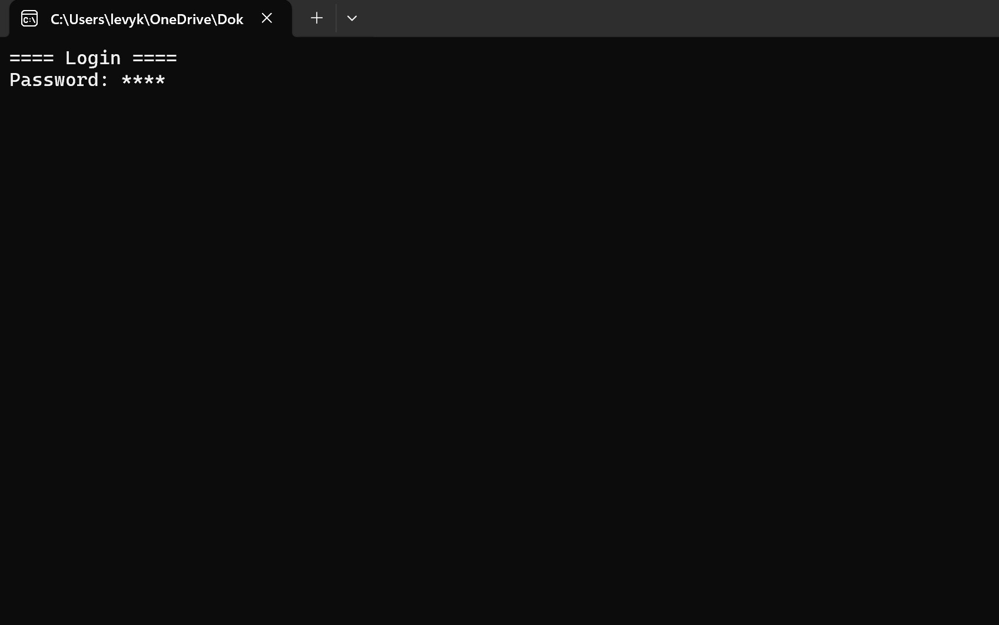
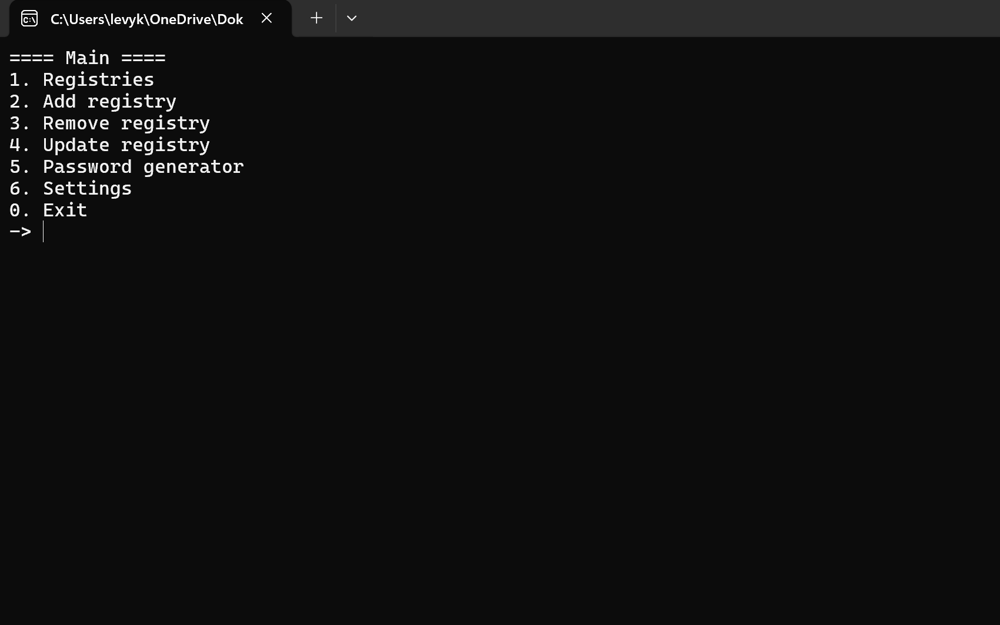
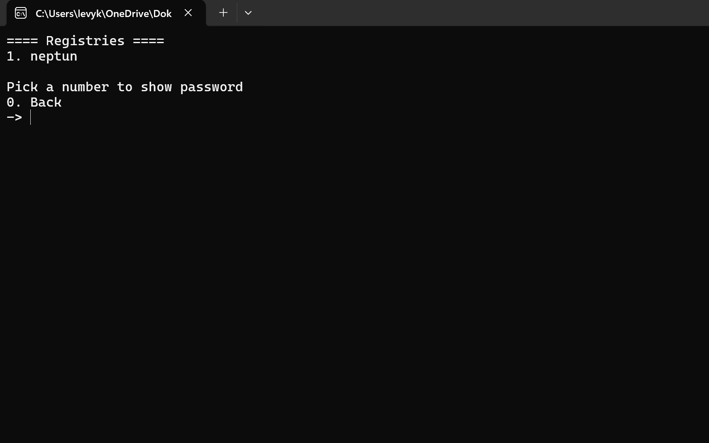
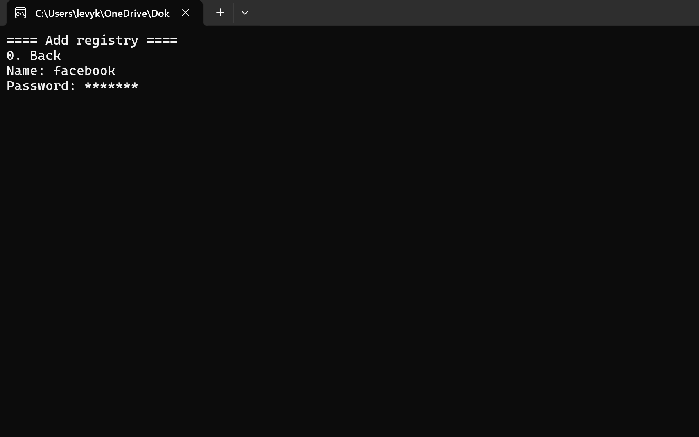
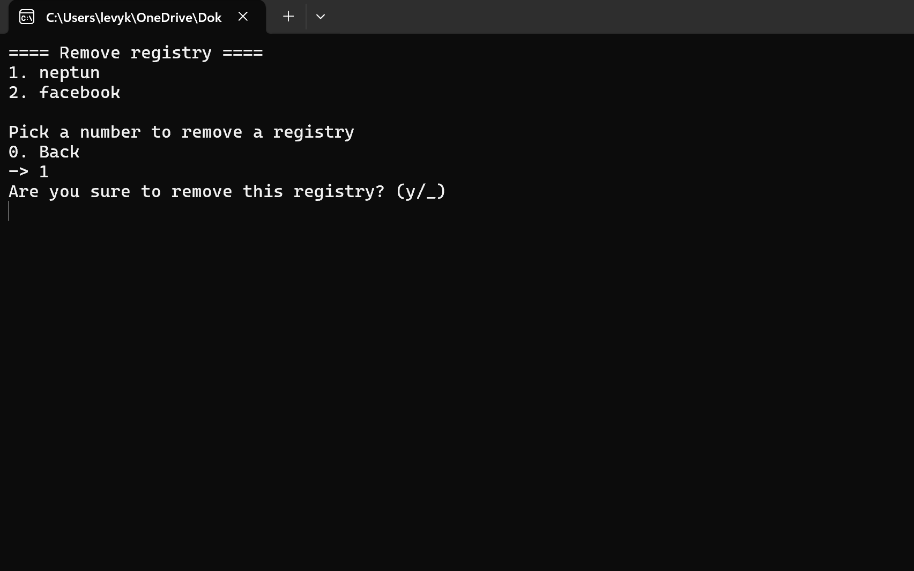
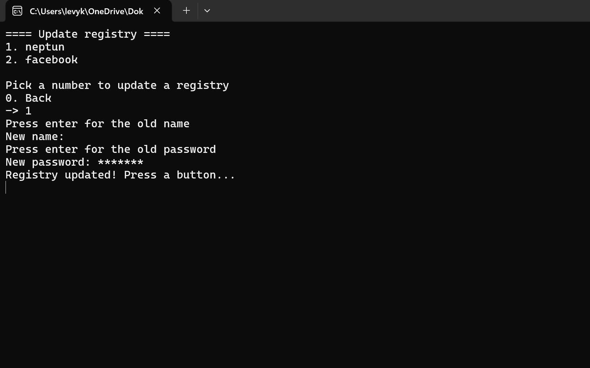
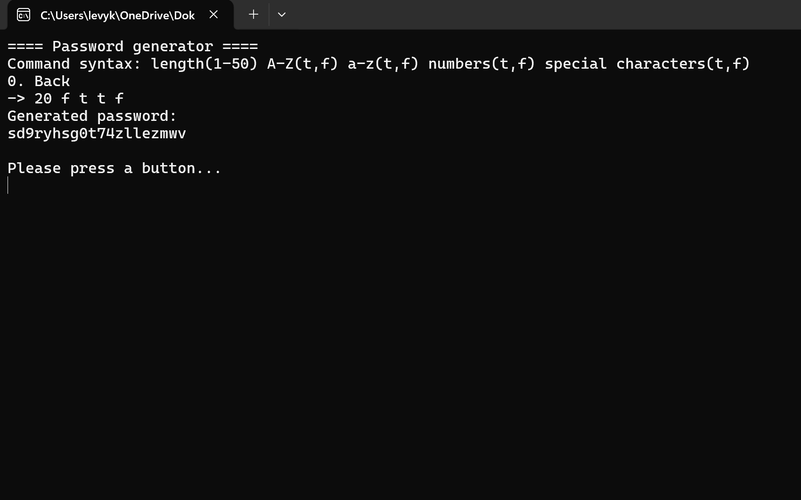
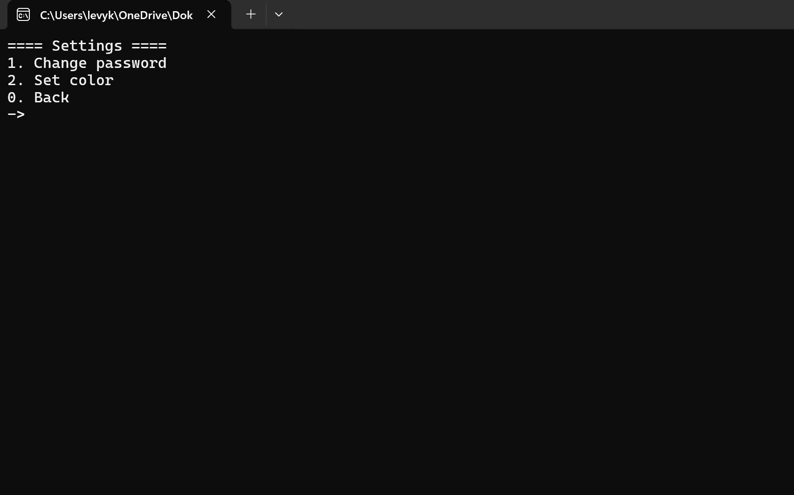
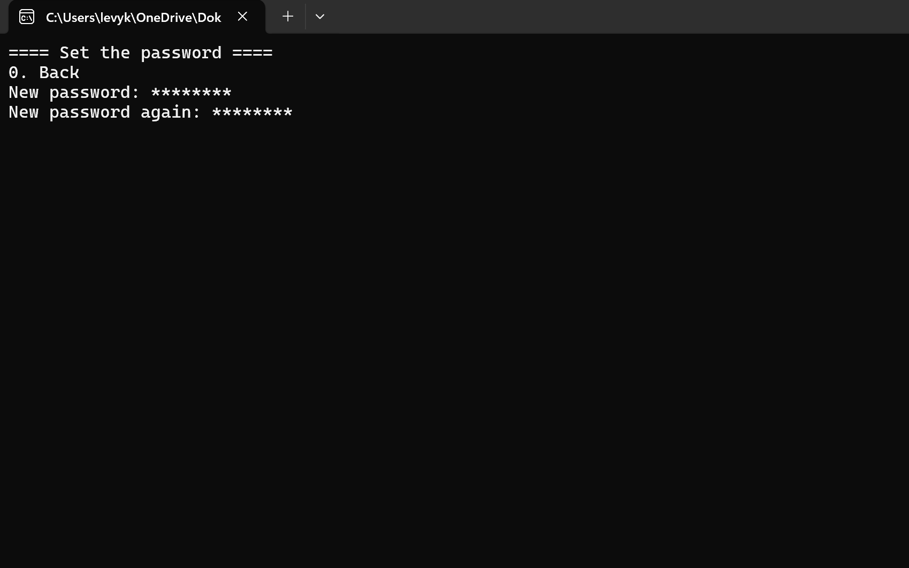
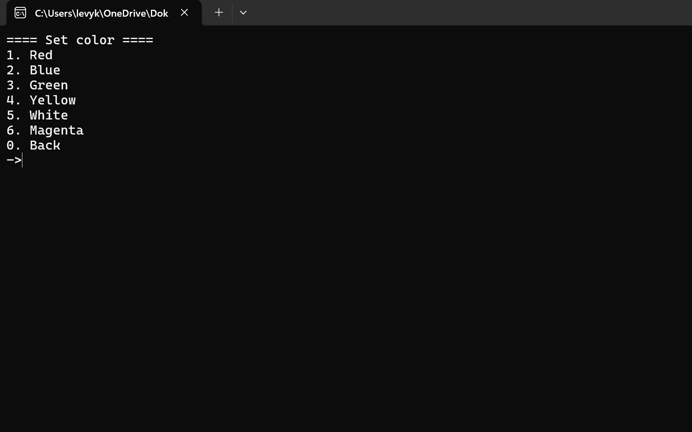

# PwdHandler

## Overview

This desktop application is designed to store passwords for specific accounts. The program is written in the F# programming language and features a CLI (Command-Line Interface) user interface.

## Motivation

The project was created so that people wouldn't have to remember the password for each of their accounts individually, since not every account uses the same password. As a result, users can easily forget which password belongs to which account. With this program, users only need to remember a single master password when logging in.

## Functions

- Add, modify, delete, and list entries

- Password generation

- Set a master password

- Set text color

## Pages

When the program loads, it checks whether a master password is already saved. If so, it loads the login page; if not, it loads the password setup page.

### Login menu
Here, the correct master password must be entered to log in.

### Main menu
This is the main menu, where users can navigate between different options.

### Show registry

### Add registry

### Remove registry

### Update registry

### Password generator
In this section, users can generate a random password. The command syntax is as follows:
length(1-50) A-Z(t,f) a-z(t,f) 0-9(t,f) special characters(t,f)
For example, if I want to generate a password that is 20 characters long, with no uppercase letters, lowercase letters included, digits included, and no special characters:
20 f t t f

### Settings

### Set password

### Set color

## Cryptography

The stored passwords and the master password are encrypted using AES encryption. Here's how it works: there is a secret key that is the same for every password, and a public key (IV) that is different for each password. This means that the IV must be stored along with the password in order for it to be decrypted later.
